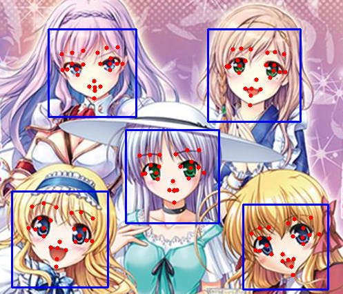

# Anime face landmark detection by deep cascaded regression
This is an implementation of deep cascaded regression for anime face landmark detection on Pytorch.



## Dependencies
- Python3.7
- Pytorch==1.3
- opencv-python

## Downloads
Download the checkpoint file from [google_drive](https://drive.google.com/open?id=1NckKw7elDjQTllRxttO87WY7cnQwdMqz) and cascade file for face detection from [nagadomi/lbpcascade_animeface](https://github.com/nagadomi/lbpcascade_animeface)

```
wget https://raw.githubusercontent.com/nagadomi/lbpcascade_animeface/master/lbpcascade_animeface.xml
```

## Usage

```
python example.py
```